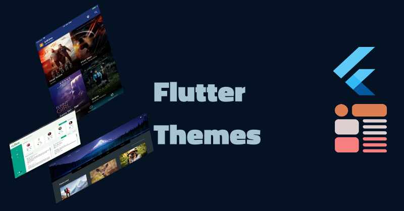

# Flutter Themes

This is the base of themes I am re-using for my UI-Kits, apps, and Flutter Design App book series. 

That is probably a hint that my first mini-book on Flutter will 
be on Flutter Themes and probably this code base will be the zip 
extra component included with that mini-book ebook.

## Videos

[Drawer List Tile Themes](https://youtu.be/55j0EvGFqik)

## Articles

[Flutter Best Practices, AppBar Themes The Right Way](https://fredgrott.medium.com/flutter-best-practices-appbar-themes-the-right-way-85a19dee1718?sk=28a2d7a3609fe607ccdb5b80cd811528)

[Maintaining A Material Design 3 Base In Flutter Themes](https://fredgrott.medium.com/maintaining-a-material-design-3-base-in-flutter-themes-7b6214cbdbc3?sk=441a9702d1b8ef98d7d9a974f81d1ede)

## About Fred Grott 
I use KeyBase for my communications:

[KeyBase](https://keybase.io/fredgrott)

I publish Front End dev and design articles at medium:
[medium](https://fredgrott.medium.com)

You can viewe my social posts on:

[Twitter](https://twitter.com/fredgrott)

[Dribbble](https://dribbble.com/FredGrott)

[DeviantArt](https://www.deviantart.com/shareme)

[BeHance](https://www.behance.net/gwsfredgrott)

My bootstrap Studio presence:
[studio](https://fredgrott.github.io)

## Useful Resources

GumRoad products such as UI Kits and Books on Flutter development
[GumRoad Products](https://app.gumroad.com/fredgrott)

MaterialUp products such as UI Kits
[MaterialUp Products](https://www.uplabs.com/fred_grott)

